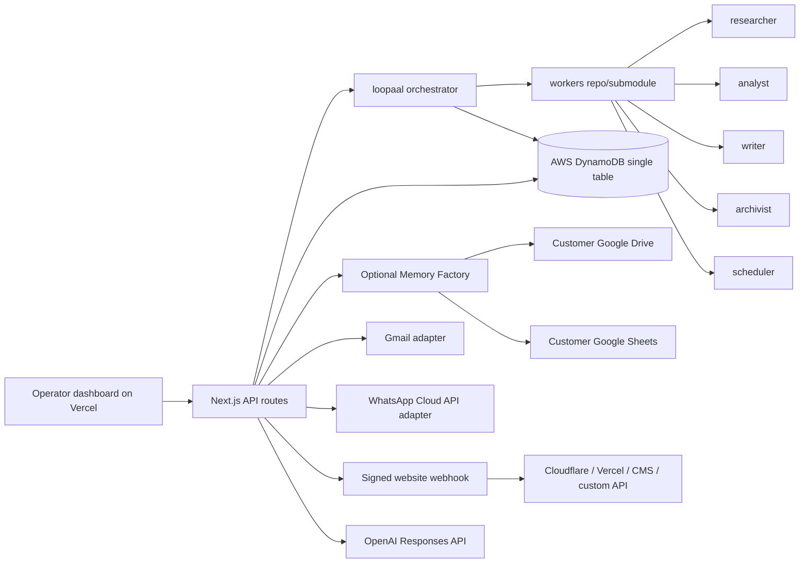

# Architecture — loopaal H0

## Deployment shape

- Vercel hosts the Next.js frontend and API routes.
- DynamoDB stores operational state, worker jobs, prospects, approvals, memory, scheduled actions, inbound replies, and audit events.
- Worker code is versioned separately under the future `workers` repo and imported by the main app.
- Gmail, WhatsApp, Sheets/Drive, and website adapters are pluggable and stay in demo mode without credentials.
- Website publishing is provider-agnostic. Cloudflare Workers are the demo path, but customers can connect any HTTPS endpoint that verifies Loopaal's HMAC signature.

## Hybrid storage model

DynamoDB is the canonical production database for Loopaal. It stores the operational state that the app depends on: campaigns, prospects, worker jobs, approvals, audit, connections, workspace identity, and normalized memory.

Google Drive/Sheets is not the production database. It is an optional customer-owned Memory Factory for context engineering: users can inspect, edit, export, and re-import memory/context in their own Drive folder and Sheet after connecting Google and granting Drive/Sheets scopes.

Campaigns must write to DynamoDB first. Drive/Sheets sync is a secondary export/import layer; if it fails or is not connected, campaign execution and core memory still work through DynamoDB and the failure is reflected in audit/logging instead of crashing the workflow.

## Data model summary

The table uses `pk` and `sk` as primary keys plus two optional GSIs:

- `gsi1pk/gsi1sk`: lookup by entity status, campaign, and due approvals.
- `gsi2pk/gsi2sk`: lookup by worker status or memory scope.
