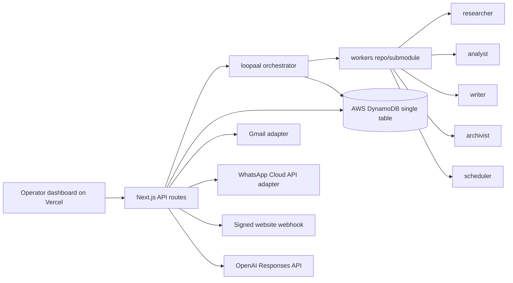

# Architecture — loopaal H0

## Deployment shape

- Vercel hosts the Next.js frontend and API routes.
- DynamoDB stores operational state, worker jobs, prospects, approvals, memory, scheduled actions, inbound replies, and audit events.
- Worker code is versioned separately under the future `workers` repo and imported by the main app.
- Gmail, WhatsApp, Sheets/Drive, and website adapters are pluggable and stay in demo mode without credentials.

## Data model summary

The table uses `pk` and `sk` as primary keys plus two optional GSIs:

- `gsi1pk/gsi1sk`: lookup by entity status, campaign, and due approvals.
- `gsi2pk/gsi2sk`: lookup by worker status or memory scope.
