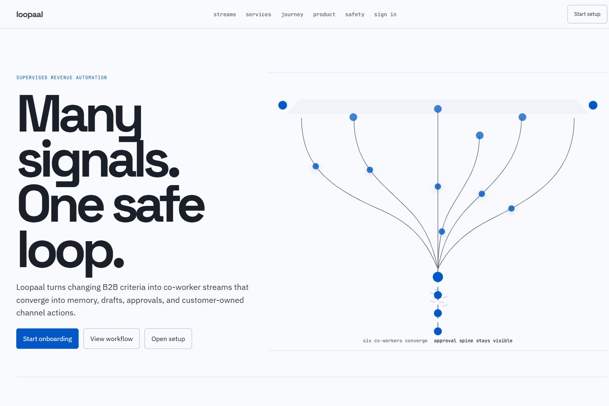
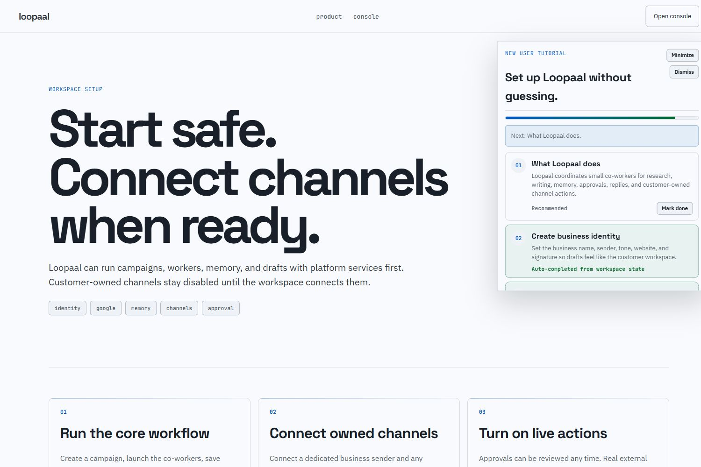
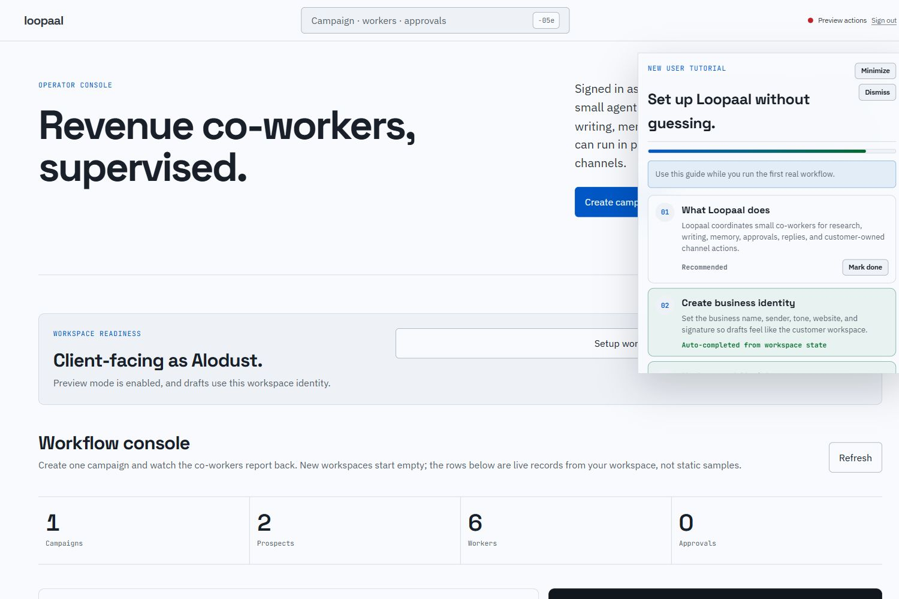
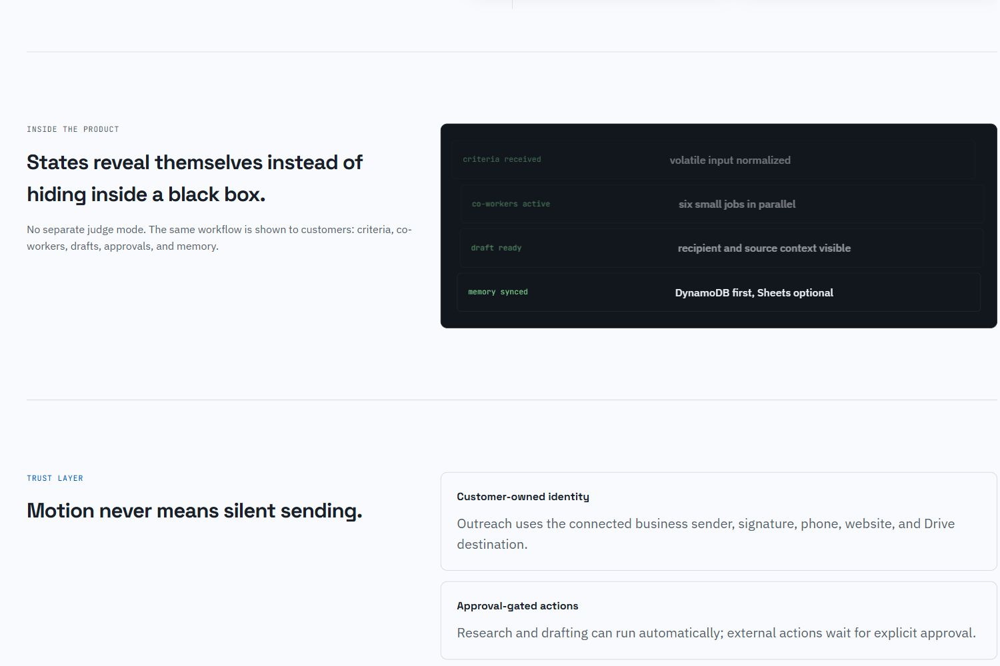

# Loopaal

Loopaal is a supervised AI revenue-ops automation platform for small businesses, agencies, and B2B operators who need outreach automation without giving a black-box agent control of their customer relationships.

The real problem it solves: prospecting and follow-up work is scattered across research, spreadsheets, inboxes, WhatsApp, website updates, approvals, and memory. Loopaal turns one volatile campaign brief into a coordinated workflow where AI co-workers research, score, draft, remember, and prepare actions, while the business owner stays in control of what is sent or changed.

## Live app

[Open Loopaal](https://loopaal.vercel.app/)

## What Loopaal can do

- Create campaign workflows from flexible criteria such as industry, country, decision-maker role, offer, notes, and recipient details.
- Run parallel co-worker agents for research, analysis, writing, memory, scheduling, and reply handling.
- Persist campaigns, prospects, worker jobs, approvals, connections, memory, onboarding state, and audit events.
- Use AWS DynamoDB as the canonical operational database.
- Use Supabase Auth for user login and workspace isolation.
- Guide new users through onboarding with a step-by-step product checklist.
- Let each workspace configure its own business identity, sender name, tone, website, reply-to, and signature.
- Connect Google OAuth for Gmail, Drive, and Sheets.
- Create real Gmail drafts when Google is connected and a verified recipient email exists.
- Store Gmail draft IDs and surface draft status in the approval workflow.
- Support Gmail token refresh so connected accounts keep working after access tokens expire.
- Use connected sender/signature identity instead of making outreach appear to come from Loopaal.
- Provide an optional Memory Factory through Google Drive/Sheets where customers can export, inspect, edit, and re-import safe context fields.
- Keep DynamoDB as source of truth even when Drive/Sheets is connected.
- Support WhatsApp Cloud API configuration for customer-owned WhatsApp business channels.
- Support signed website webhooks for Cloudflare Workers, Vercel, CMS platforms, or custom HTTPS endpoints.
- Test configured website webhooks from the setup page.
- Keep external actions approval-gated by default.
- Show prospects, worker jobs, approvals, memory, and audit trail in the dashboard.
- Show side notifications when actions complete or fail.
- Keep new workspaces empty until real campaigns are run.
- Limit Loopaal-provided AI to the first 5 campaigns per workspace.
- Require future customer-owned AI connections to use OAuth or secure vault references instead of raw API keys in the app database.
- Fall back to deterministic local behavior when AI credentials are unavailable.

## AI feature

Loopaal uses AI for supervised B2B outreach drafting. After the campaign and prospect records exist, the writer flow asks the AI model to produce a concise Gmail or WhatsApp draft using only the known campaign, sender, and prospect data. If the model call fails or credentials are unavailable, Loopaal falls back to a deterministic draft so the workflow still works.

The core AI instruction behind outreach drafting is:

```text
Write supervised B2B outreach on behalf of the connected customer workspace, not on behalf of Loopaal.
Use only the provided prospect and campaign facts. Do not invent revenue, clients, contact names, awards, or pain points.
Use the provided sender/business identity naturally. Do not mention Loopaal unless it appears in the user's business identity or offer.
For Gmail, do not add an email signature; the connected sender signature is appended separately.
For WhatsApp, a short provided signature/footer may be used once at the end.
Keep it concise, credible, and low-pressure. No spam wording, fake urgency, or exaggerated claims.
Return strict JSON only.
```

The model receives structured input containing:

- channel: `gmail` or `whatsapp`
- sender identity: business name, sender name, reply-to, tone, website URL, and optional signature
- campaign: name and criteria
- prospect: business name, industry, country, contact role, website, confidence, facts, and sources

This keeps the AI narrow: it drafts from verified context, does not silently send, and hands the result back to the approval queue.

## Tools, services, and models

- Next.js App Router
- TypeScript
- React
- Vercel
- AWS DynamoDB
- Supabase Auth
- Google OAuth
- Gmail API
- Google Drive API
- Google Sheets API
- Meta WhatsApp Cloud API
- Signed website webhooks with HMAC-style verification
- Cloudflare Workers-compatible webhook endpoint design
- Gemini 2.5 Flash through the Google Generative Language API
- Optional OpenAI adapter support through environment configuration
- Node.js 24+
- CSS/SVG motion for the landing page, without heavy animation libraries

## Screenshots

### Landing page



### Setup and owned channel connections



### Dashboard workflow



### Product state preview



## How to run the project

Requires Node.js 24+.

```powershell
Copy-Item .env.example .env
npm install
npm run dev
```

Open:

```text
http://localhost:3000
```

The app starts at the landing page, then moves users through sign-up/sign-in, setup, and the dashboard workflow.

### Minimal local configuration

For local development without cloud credentials:

```env
LOOPAAL_STORE=demo
AI_PROVIDER=demo
NEXT_PUBLIC_APP_URL=http://localhost:3000
OUTBOUND_SENDS_LIVE=false
```

This mode keeps the workflow non-destructive and uses local development persistence/fallbacks.

### Production-style configuration

For a production-style run, configure:

```env
LOOPAAL_STORE=dynamodb
LOOPAAL_TABLE_NAME=loopaal
AWS_REGION=us-east-1
AWS_ACCESS_KEY_ID=...
AWS_SECRET_ACCESS_KEY=...
NEXT_PUBLIC_APP_URL=https://your-domain.example
NEXT_PUBLIC_SUPABASE_URL=...
NEXT_PUBLIC_SUPABASE_ANON_KEY=...
GOOGLE_CLIENT_ID=...
GOOGLE_CLIENT_SECRET=...
GOOGLE_REDIRECT_URI=https://your-domain.example/api/connections/google/callback
AI_PROVIDER=gemini
GEMINI_API_KEY=...
GEMINI_MODEL=gemini-2.5-flash
OUTBOUND_SENDS_LIVE=false
```

Keep `OUTBOUND_SENDS_LIVE=false` unless you intentionally want approved actions to execute against connected customer-owned channels.

## Project docs

- [PRD.md](./PRD.md)
- [TRD.md](./TRD.md)
- [Architecture.md](./Architecture.md)
- [WORKERS.md](./WORKERS.md)
- [PROJECT_RULES.md](./PROJECT_RULES.md)
- [PLANNING.md](./PLANNING.md)
- [AWS.md](./AWS.md)
- [VERCEL.md](./VERCEL.md)
- [GMAIL.md](./GMAIL.md)
- [MEMORY_FACTORY.md](./MEMORY_FACTORY.md)
- [WEBSITE_WEBHOOKS.md](./WEBSITE_WEBHOOKS.md)

## Safety model

- Research and drafting may run automatically.
- Email, WhatsApp, and website changes require approval by default.
- Preview mode never sends real external messages.
- Real external actions require `OUTBOUND_SENDS_LIVE=true` and customer-owned channel credentials.
- Customer AI credentials must use OAuth or a secure vault reference; raw AI API keys are not stored in DynamoDB, local storage, or session storage.
- Public-web research must respect source terms, privacy rules, opt-outs, and applicable anti-spam laws.
- Every meaningful transition is written to the audit log.
